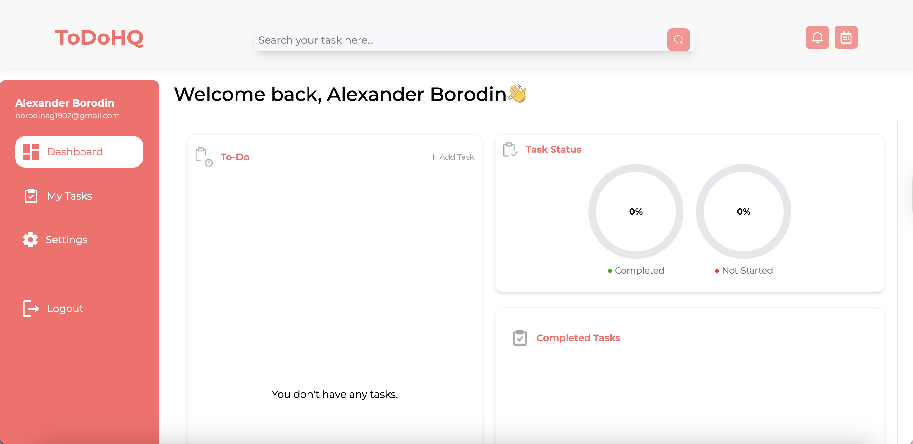

# 🧠 ToDoHQ — Smart Task Manager

[](https://vitejs.dev/)
[](https://reactjs.org/)
[](https://www.typescriptlang.org/)
[](https://tailwindcss.com/)
[](https://redux-toolkit.js.org/)
[](https://github.com/Borodin1)

---

ToDoHQ is a modern task management application with an intuitive interface and advanced features like prioritization, deadlines, filtering, progress indicators, and much more.

 <!-- Replace or add if you have an image -->

## 🚀 Demo

> ⚙️ *Work in progress...*  
> Demo will be available at: _(coming soon)_

---

## 🛠 Getting Started

### 1. Clone the repository
```
git clone https://github.com/Borodin1/ToDoHQ.git
cd ToDoHQ
```

### 2. Install dependencies

```
npm install
``` 
### 3. Run development server
```
npm run dev
```

### 4. Build for production
```
npm run build
```

🔐 Authentication  
The app uses JWT authentication. After registering or logging in:

A JWT token is stored in localStorage

Task management is available only for authenticated users


🧑‍💻 Author  
Alexander Borodin  
Frontend Developer | React / TypeScript  
[GitHub](https://github.com/Borodin1)
